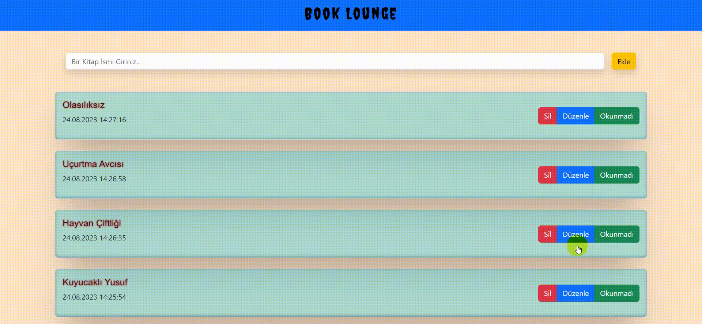

# Book Lounge

Book Lounge, kullanıcıların şık ve sade bir arayüzde kitapları kaydedebildiği bir React projesidir. Kullanıcılar bu uygulama aracılığıyla kitapları ekleyebilir, düzenleyebilir, işaretleyebilir ve silebilirler. Her kitap, kaydedildiği tarih ve saat ile birlikte özel bir kartta gösterilir.

## Özellikler
-Kitap eklemek için gerekli bilgileri girin ve inputun yanında bulunan "Ekle" buttonuna tıklayın.

-Kaydedilen kitaplar cart şeklinde tarih ve saat bilgisiyle sayfanın içerisine basılır.

-Her bir kartta "Düzenle", "Okundu" ve "Sil" buttonları bulunur. Düzenle düğmesi ile kitap bilgilerini güncelleyebilir, Okundu düğmesi ile kitabı işaretleyebilir ve Sil düğmesi ile kitabı silebilirsiniz.

# Book-Lounge
